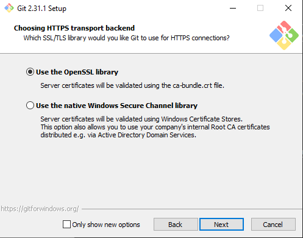

# 
Установка окружения Git

###### 
Git Logo by Jason Long, License: CC BY 3.0

---

<a href = "./hellinks.md"> << [Назад]</a> Полезные ссылки.

---

Скачиваем инсталятор системы [Git](https://git-scm.com/download/win) и открываем инсталятор:

Ознакамливаемся с лицензией и нажимаем <b>Next</b> 

---

Здесь можете выбрать необходимые компоненты для установки, мы же оставляем стандартные установки и нажимаем <b>Next</b> 

---

Здесь выбираем предпочтительный редактор, в нашем случае VScode, нажимаем <b>Next</b> 

---

Здесь вы можете сменит наименование главной ветви, в нашем случае оставляем стандартное имя ветви, нажимаем <b>Next</b> 

---

Здесь предоставляется возможность выбрать один из трех типов взаимодействия с системой Git, в нашем случае следуем рекомендации разработчиков, нажимаем <b>Next</b> 

---

Здесь можем выбрать предпочтительный тип сертификации, оставляем без изменений, нажимаем <b>Next</b> 

---

Здесь предоставляется выбор преобразований заканчивающих строку, оставляем без изменений, нажимаем  <b>Next</b> 

---

Здесь можно выбрать предпочтительный тип консольной програмы, оставляем без изменений, нажимаем <b>Next</b> 

---

Здесь предоставлен выбор типа слития ветвей системы Git, оставляем без изменений, нажимаем <b>Next</b> 

---

Здесь предоставлен выбор помощника по учете данных, оставляем без изменений, нажимаем <b>Next</b> 

---

Здесь можно включить поддержку емуляцию консолей других програм, оставляем без изменений, нажимаем <b>Next</b> 

---

Здесь можно посмотреть используемые PID, нажимаем <b>Install</b> 

---

Поздравляем вы успешно установили Git 

---

 Базовые команды Git Bash. <a href = "./git init.md">[След.] >></a>

---

*
LICENSE:* [MIT](./licenseRus.md) [[eng](/license.md)]
